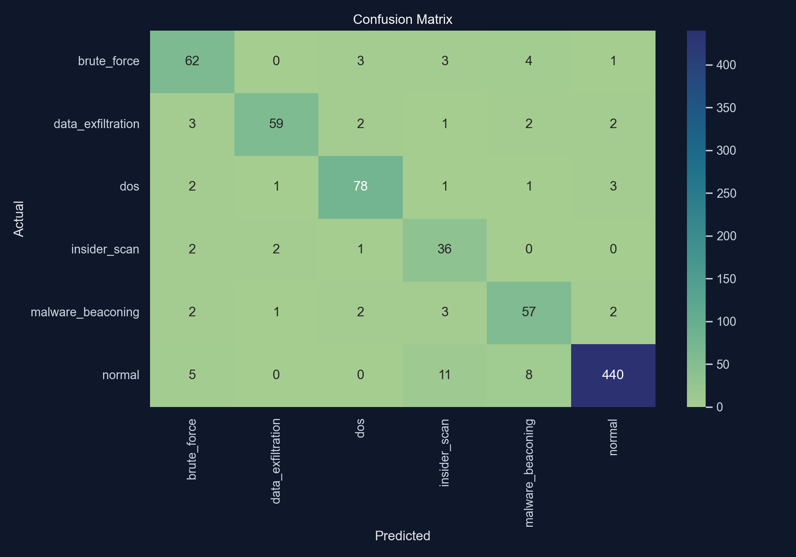
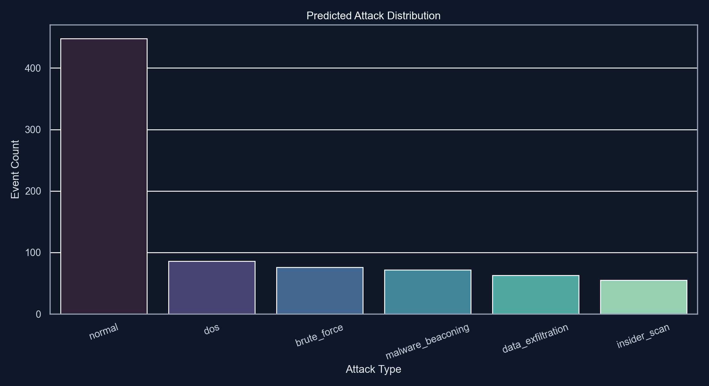
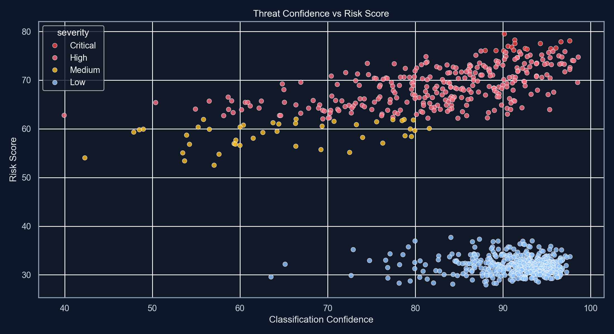
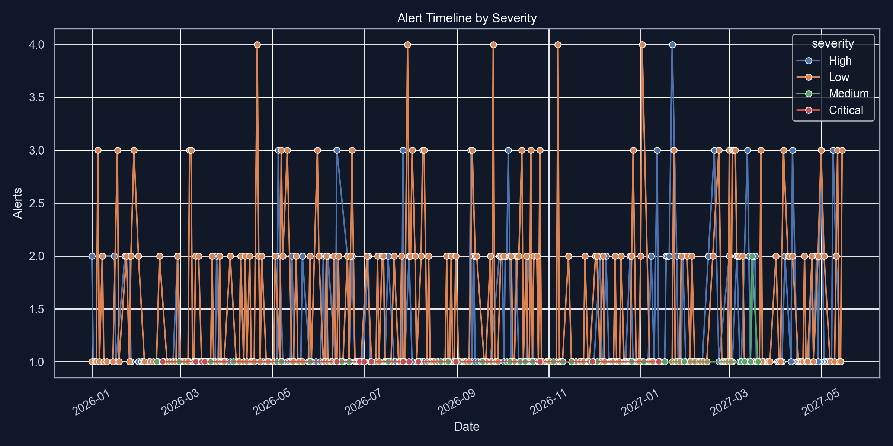
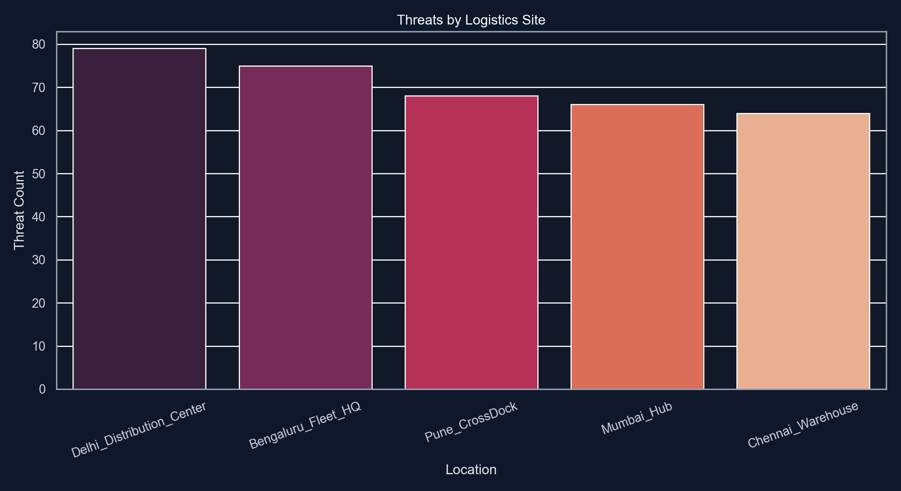
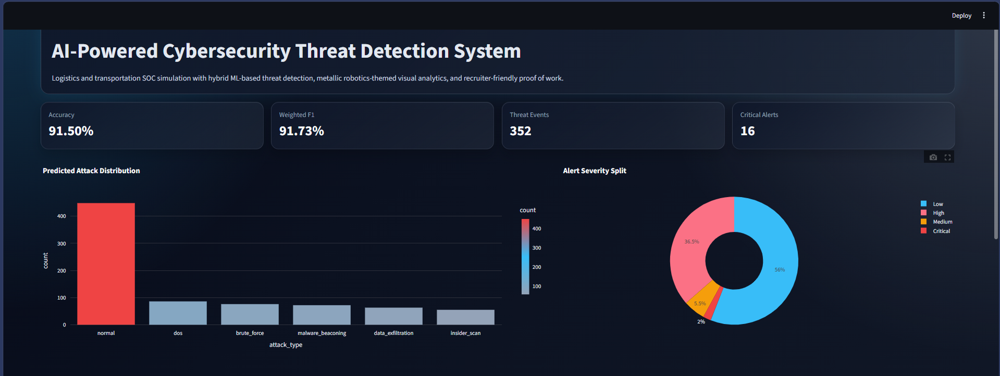
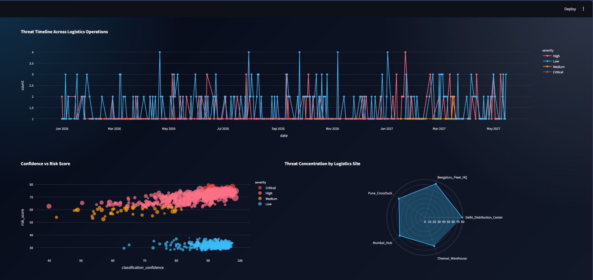
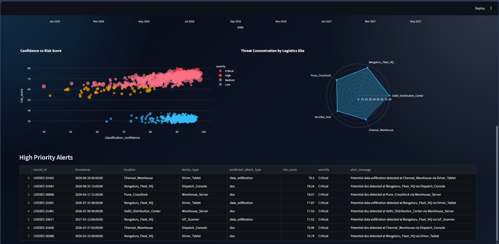

# AI-Powered Cybersecurity Threat Detection System

An intermediate-level, industry-oriented cybersecurity project that simulates a Security Operations Center workflow for a logistics and transportation company. The system generates realistic enterprise-style network telemetry, engineers security features, trains a hybrid ML detection pipeline, assigns threat severity, and visualizes results in a metallic robotics-themed dashboard.

## Project Snapshot

- Domain: Logistics and transportation cybersecurity
- Use case: Detect suspicious activity across fleet gateways, warehouse servers, dispatch consoles, IoT scanners, and driver tablets
- Approach: `RandomForestClassifier` for attack classification + `IsolationForest` for anomaly detection
- Dataset: Synthetic but industry-shaped logistics SOC telemetry generated locally
- Current model performance: `91.5%` accuracy and `91.73%` weighted F1 on the held-out test split
- Dashboard: Streamlit + Plotly with metallic blue/steel styling
- GPU required: No

## Problem Statement

Logistics companies depend on connected systems such as transport management platforms, warehouse scanners, GPS gateways, dispatch consoles, APIs, and VPN-connected field devices. These systems generate large volumes of security-relevant data, and manual monitoring is slow, repetitive, and easy to miss. This project shows how AI/ML can help classify attacks, detect anomalies, and convert raw events into analyst-friendly alerts.

## Industry Relevance

This project mirrors how modern companies use AI-powered detection systems:

- Banks use them to flag fraud, suspicious logins, and abnormal transaction or device behavior.
- IT services companies use them to monitor internal access misuse, brute-force attempts, and endpoint anomalies.
- Product-based companies use them to secure production traffic, cloud APIs, user authentication flows, and malware signals.
- Logistics companies use them to protect route systems, warehouse OT/IoT devices, dispatch systems, and fleet VPN connectivity.

## Selected Approach

Three paths were considered:

- Option A: Easiest. Rule-based checks + a simple classifier on a small public dataset. Good for first ML exposure, but weaker GitHub proof.
- Option B: Intermediate. Hybrid classification + anomaly detection with synthetic enterprise telemetry and a professional dashboard. Best balance of learning, realism, and execution.
- Option C: Advanced. Real log ingestion, deep learning, threat intel enrichment, and streaming architecture. Strongest technically, but too heavy for a student starter project.

This repository implements **Option B**.

## Architecture

```text
Synthetic Logistics Telemetry
        |
        v
Dataset Loading -> Cleaning -> Feature Engineering
        |               |              |
        |               |              -> traffic ratio, auth failure rate,
        |               |                 bytes/packet, session intensity,
        |               |                 lateral movement score
        v
Train / Test Split
        |
        +--> Random Forest Classifier -> predicted attack type
        |
        +--> Isolation Forest -> anomaly flag + anomaly score
        |
        v
Risk Scoring + Severity Mapping
        |
        v
Alerts, Reports, Charts, Dashboard
```

## Folder Structure

```text
AI-Cybersecurity-Threat-Detection/
|
|-- data/
|   |-- raw/
|   |   `-- logistics_cyber_threat_dataset.csv
|   `-- processed/
|       |-- train_dataset.csv
|       `-- test_dataset.csv
|-- dashboard/
|   `-- app.py
|-- docs/
|   |-- github_proof_plan.md
|   `-- project_guide.md
|-- models/
|   |-- isolation_forest.joblib
|   |-- label_encoder.joblib
|   |-- preprocessor.joblib
|   `-- rf_classifier.joblib
|-- outputs/
|   |-- metrics/
|   |   `-- model_metrics.json
|   |-- plots/
|   |   |-- alert_timeline.png
|   |   |-- attack_distribution.png
|   |   |-- confusion_matrix.png
|   |   |-- location_threats.png
|   |   `-- risk_scatter.png
|   `-- reports/
|       |-- predictions.csv
|       |-- project_summary.csv
|       `-- threat_alerts.csv
|-- src/
|   |-- config.py
|   |-- data_preprocessing.py
|   |-- detect_threats.py
|   |-- feature_engineering.py
|   |-- generate_data.py
|   |-- pipeline.py
|   |-- train_model.py
|   `-- visualize.py
|-- .gitignore
|-- main.py
|-- README.md
`-- requirements.txt
```

## Installation

### Windows

```powershell
python -m venv .venv
.venv\Scripts\activate
pip install --upgrade pip
pip install -r requirements.txt
```

### Mac/Linux

```bash
python3 -m venv .venv
source .venv/bin/activate
pip install --upgrade pip
pip install -r requirements.txt
```

## How To Run

### 1. Run the full ML pipeline

```powershell
python main.py
```

This will:

- generate the logistics cybersecurity dataset
- clean and engineer features
- train the models
- evaluate performance
- create alerts
- save charts and reports

### 2. Launch the dashboard

```powershell
streamlit run dashboard/app.py
```

## Key Features

- Synthetic logistics-company SOC telemetry with labeled attack types
- Threat classes: `normal`, `dos`, `brute_force`, `data_exfiltration`, `malware_beaconing`, `insider_scan`
- Hybrid ML pipeline for classification and anomaly detection
- Risk-based alerting with `Low`, `Medium`, `High`, and `Critical` severity
- Plot exports ready for README screenshots
- Recruiter-friendly project structure and documentation

## Current Results

- Accuracy: `0.915`
- Weighted Precision: `0.9222`
- Weighted Recall: `0.915`
- Weighted F1: `0.9173`
- Test events: `800`
- Predicted threats: `352`
- Critical alerts: `16`
- High alerts: `292`

## Output Assets To Showcase

- Confusion matrix: 
- Attack distribution: 
- Risk scatter plot: 
- Alert timeline: 
- Location threat plot: 
## Dashboard output:
-
-
-

## Simulation Story

This project simulates a transportation company with multiple logistics sites. Each record represents network or security telemetry from locations such as hubs, warehouses, cross-docks, and fleet operations. The generated attack patterns emulate:

- DoS spikes targeting exposed logistics systems
- Brute-force attempts against dispatch and warehouse logins
- Data exfiltration from warehouse or route management systems
- Malware beaconing from infected endpoints
- Insider scanning and lateral movement activity

## GitHub Strategy

- Keep commit history clean and progress-based
- Upload plot assets and dashboard screenshots
- Add a strong README summary and architecture diagram
- Use tags such as `cybersecurity`, `machine-learning`, `soc`, `threat-detection`, `streamlit`, `python`, `anomaly-detection`

Detailed guidance is in [docs/project_guide.md](docs/project_guide.md) and [docs/github_proof_plan.md](docs/github_proof_plan.md).

## Learning Outcomes

- Understanding security telemetry and SOC thinking
- Converting raw event data into ML-ready features
- Combining supervised learning with anomaly detection
- Building alert scoring logic instead of raw predictions only
- Presenting an end-to-end AI project professionally on GitHub

## Resume / Interview Pitch

Built an AI-powered cybersecurity threat detection system for a simulated logistics enterprise using Python, scikit-learn, anomaly detection, alert scoring, and a Streamlit dashboard. The project classifies multiple cyberattack patterns, flags anomalies, visualizes SOC metrics, and demonstrates practical security analytics workflow from data generation to dashboard reporting.
